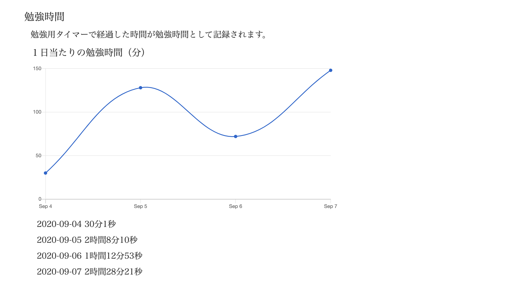

## アプリケーション名
Learning Efficiency

## アプリケーション概要
効率的な学習をサポートするアプリです。

人間は思い出そうとするときに、物事を記憶しやすいということがわかっています。自分で問題を作成して、その問題を解くことで物事の記憶をしやすくすることが狙いです。

人間の集中力は何時間も続かないことがわかっています。勉強時間をタイマーにセットすることで、集中力が低下しないうちに休憩を促すようにしています。勉強の終わりを明確にすることでモチベーションの維持にも繋がります。

人間は自分の成果や記録を見るとモチベーションが維持されやすいことがわかっています。タイマーで経過した時間が記録され、グラフや数字で確認することができるため、モチベーションの維持に繋がります。

## URL
http://54.95.109.108

## テスト用アカウント
メールアドレス

sample@sample.co.jp

パスワード

asd123

## 利用方法
マイページにて、タイマーのページを開き（新規タブが開きます）、自分がこれから勉強する時間をタイマーにセットしてもらいます。  
それから勉強を始めていただき、覚えたい語句などが勉強中に出てきたら、マイページから問題作成をして、任意のタイミングでその問題を解いてもらいます。  
問題を解く際に、その問題が自分にとって簡単だったか難しかったかを選択する箇所があるので、作成した問題が全て簡単だったと選択できるように学習をしてもらいます。  
タイマーにセットした時間が経過したら、音が鳴り、自動で休憩時間を5分計るので、リフレッシュする時間に充ててください。５分で足りない場合は調整してください。

## 目指した課題解決
性別 女性 年齢 30~40代 職業 主婦

子供に勉強してほしいけど、どうすればいいかわからない。自室で勉強しているみたいだけど、本当に勉強しているかわからない。勉強をやったとしてもやる気が続かないため、定期テストはうまくいっても受験が心配。

上記の不安や悩みを抱えている方の課題解決のために、このアプリケーションを作成しました。問題作成機能を確認することによって、親は子供が勉強しているかを把握できるだけでなく、どんな勉強をしているかも把握することができます。子供の勉強のやる気が続かないのは親が子供の勉強内容に関心がないことも考えられるため、親と子供のコミュニケーションにも役に立つと思われます。

## 洗い出した要件
| 機能 | 目的 | 詳細 | ストーリー(ユースケース) |
| --- | ---- | --- | ------------------ | 
| 問題作成機能 | 自分で作成した問題を解くことで知識の定着を図る。 | 問題の作成を可能とする。 | ・問題ごとに自分の解答履歴を確認できる。  ・問題文を編集、削除できる。  ・他のユーザーが作成した問題を解くことができる。  ・解答した問題の手応えを入力できる。 | 
| タイマー機能 | 勉強と休憩を時間で管理することで集中力を継続することが可能。 | 勉強時間を設定して、その時間が経過すると音が鳴り、休憩時間になることを知らせる。 | ・他のページに遷移してしまうと、タイマーがリセットしてしまうため、タイマーページは新規タブで表示される。  ・タイマーのスタートボタンを押すと、ストップボタンに切り替わる。  ・勉強用のタイマーが0秒になると、休憩用のタイマーが自動で作動する。 | 
| 勉強時間管理機能 | 今までの勉強時間を目視することでモチベーションを維持することが可能。 | タイマー機能で経過した勉強時間を計測して、グラフで表示する。 | ・休憩用タイマーで経過した時間は勉強時間に含めないようにする。  ・日付ごとに勉強した時間を確認できるようにする。  ・勉強用タイマーがストップしている間は勉強時間に含めないようにする。 | 
| ユーザー検索機能 | ユーザーが他のユーザーを検索出来るようにする。 | ユーザー名での検索を可能にする。 | ・ユーザーは複数人いることが前提。 | 
## 実装した機能についてのGIFと説明

### 問題作成機能
問題を作成し、それに対して解答、編集、削除ができる機能です。解答した内容を閲覧可能です。他のユーザーが作成した問題を解くこともできます。
利便性向上のため、JavaScriptを利用して一部のボタンを非同期にしています。

### タイマー機能
タイマーを使って、勉強時間終了と休憩時間終了をお知らせする機能です。お知らせの際に、音が鳴り、ポップアップが表示されます。
JavaScriptを利用して実装しています。

### 勉強時間管理機能
タイマー機能の勉強用タイマーで経過した時間をマイページに記録する機能です。グラフで日付ごとに勉強時間が確認できます。
Ajaxを利用して実装しています。

### ユーザー検索機能
ユーザーを検索することができる機能です。  
collectionをルーティングに設定することで実装しています。

### ページネーション機能
ユーザー一覧ページや勉強時間管理ページ、問題一覧ページにてページネーション機能を付けました。  
kaminariというgemを利用して実装しています。

## 実装予定の機能

作成した問題にタグを付け、それを元に検索や問題の整理をすることができる機能。

間違えた問題を抽出する機能。

## ローカルでの動作方法

1. git clone https://github.com/aimaimi/study-app.git

2. cd study-app

3. bundle install

4. yarn install

5. rails db:create

6. rails db:migrate

7. rails s

### パッケージ

Ruby 2.6.5

#### 使用Gem

* devise

* pry-rails

* active_hash

* chartkick

* rails-i18n

* rubocop

* capistrano

* factory_bot_rails

* faker

* unicorn

* kaminari

#### AWS EC2

Webサーバー Nginx

## データベース設計

## ER図
https://gyazo.com/35b64078a3c985704c263ff6fa34a85e

## テーブル設計
 
## users テーブル
 
| Column       | Type   | Options     |
| ------------ | ------ | ----------- |
| nickname     | string | null: false |
| password     | string | null: false |
 
### Association
 
- has_many :questions
- has_many :answers
- has_many :time_managements
 
## questions テーブル
 
| Column                 | Type       | Options                        |
| -------------------    | ------     | -------------------------------|
| title                  | string     | null: false                    |
| content                | text       | null: false                    |
| user_id                | references | null: false, foreign_key: true |

### Association
 
- belongs_to :user
- has_many :answers
 
## answers テーブル
 
| Column        | Type       | Options                        |
| ------------- | ------     | -------------------------------|
| feedback      | integer    | null: false                    |
| content       | text       | null: false                    |
| question_id   | references | null: false, foreign_key: true |
| user_id       | references | null: false, foreign_key: true |

### Association
 
- belongs_to :user
- belongs_to :question
 
## time_managements テーブル
 
| Column              | Type       | Options                        |
| ------------------- | ------     | -------------------------------|
| date                | date       | null: false                    |
| time                | integer    | null: false                    |
| user_id             | references | null: false, foreign_key: true |
 
- belongs_to :user

